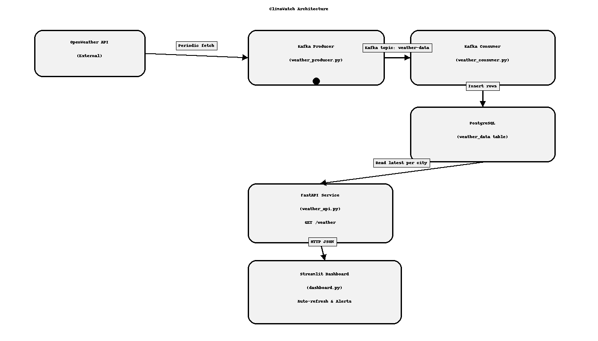

# 🌐 ClimaWatch: Real-Time City Weather Tracker

A **Real-Time Weather Data Pipeline** that fetches live data from the OpenWeather API, streams it via Kafka, stores it in PostgreSQL, and displays insights on an interactive Streamlit dashboard.

---

## 🚀 Features
- 🌦 Fetches live weather data for multiple cities every 10 seconds.
- 📡 Streams data to Apache Kafka for real-time processing.
- 🗄 Stores weather metrics in PostgreSQL.
- ⚡ FastAPI endpoint serving the latest weather per city.
- 📊 Streamlit dashboard with alerts for extreme conditions.

---

## 🛠 Tech Stack
- **Programming**: Python, FastAPI, Streamlit
- **Messaging**: Apache Kafka
- **Database**: PostgreSQL
- **Containerization**: Docker & Docker Compose
- **API**: OpenWeather API

---

## 📂 Project Structure
weather_api.py          # FastAPI backend for serving latest weather data
weather_producer.py     # Fetches weather data & pushes to Kafka
weather_consumer.py     # Consumes Kafka data & stores in PostgreSQL
dashboard.py            # Streamlit dashboard with alerts
docker-compose.yaml     # Kafka, Zookeeper, PostgreSQL services
requirements.txt        # Python dependencies
cities.py               # List of cities to monitor
architecture.png        # System architecture diagram
README.md               # Project documentation
.gitignore              # Git ignore rules

## 🖼 Architecture

### PNG Diagram


### Mermaid Diagram (GitHub renders it)
```mermaid
flowchart TB
  A[OpenWeather API] -->|Fetch every 10s| B[Kafka Producer<br/>weather_producer.py]
  B -->|topic: weather-data| C[Kafka Consumer<br/>weather_consumer.py]
  C --> D[(PostgreSQL<br/>weather_data)]
  D -->|Read latest per city| E[FastAPI<br/>weather_api.py<br/>GET /weather]
  E -->|HTTP JSON| F[Streamlit Dashboard<br/>dashboard.py]

⚙️ Setup Instructions
1️⃣ Clone Repository
bash
Copy
Edit
git clone https://github.com/your-username/climawatch.git
cd climawatch

2️⃣ Create .env File
env
Copy
Edit
OPENWEATHER_API_KEY=your_openweather_api_key

🐳 Run with Docker Compose
This project includes a preconfigured docker-compose.yaml file that starts Apache Kafka, ZooKeeper, and PostgreSQL.

Start Services
bash
Copy
Edit
docker-compose up -d
Services started:

ZooKeeper (for Kafka)

Kafka broker (localhost:9092)

PostgreSQL (localhost:5432)

Check Containers
bash
Copy
Edit
docker ps
Access PostgreSQL
bash
Copy
Edit
docker exec -it postgres psql -U postgres -d weather
Stop All Services
bash
Copy
Edit
docker-compose down
▶ Run the Pipeline
Once Docker services are up, run the components in separate terminals:

bash
Copy
Edit
# Terminal 1: Producer
python weather_producer.py

# Terminal 2: Consumer
python weather_consumer.py

# Terminal 3: FastAPI server
uvicorn weather_api:app --reload --port 5000

# Terminal 4: Streamlit dashboard
streamlit run dashboard.py
📸 Screenshot

📜 License
This project is licensed under the MIT License - see the LICENSE file for details.

Copy
Edit

---

This file already includes:
- **Features**
- **Tech stack**
- **Project structure** (with each file and its purpose)
- **Architecture** (PNG + Mermaid diagram)
- **Setup and run instructions**
- **Docker section**
- **Screenshot placeholder**
- **License section**